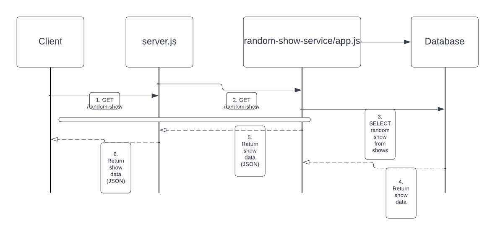

Random Show Microservice
The Random Show Microservice is a Node.js application that provides a random TV show from a MySQL database through a REST API endpoint. It also connects to a MongoDB database for potential future use.

Prerequisites
Node.js and npm installed
MySQL and MongoDB running locally
A MySQL database with a table named shows

Setup
1. Navigate to the project directory using this terminal command:
   cd random-show-service

2. Install the dependencies:
   npm install mongodb 

Update the MySQL and MongoDB connection details in app.js with the mysql information:

// MySQL connection
const db = mysql.createConnection({
    host: 'localhost',
    user: 'your_username',
    password: 'your_password',
    database: 'your_database'
});

// MongoDB connection
const mongoClient = new MongoClient('mongodb://localhost:27017');
const dbName = 'your_mongodb_database';

Running the Microservice
Start the microservice by running:

        node app.js

The microservice will be running on http://localhost:3001.

Testing the Microservice
To test the microservice and get a random show, you can use the provided testRandomShow.js script:

        node testRandomShow.js

This script will make a request to the /random-show endpoint and print the response in the console.

